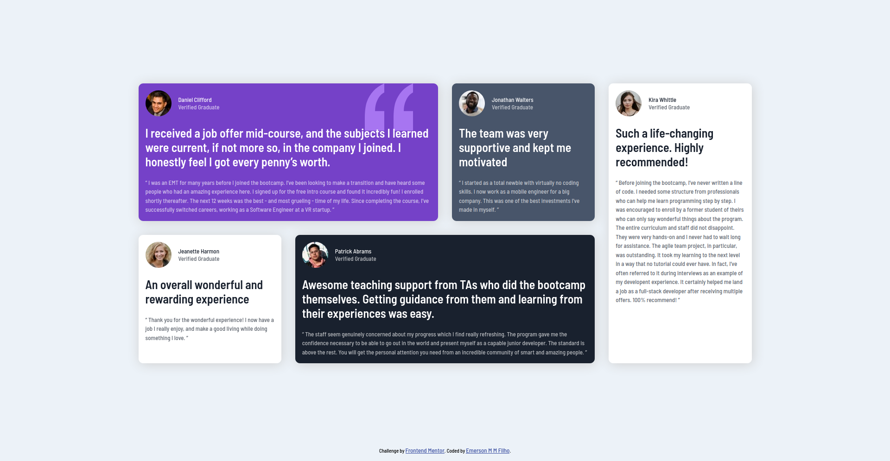

# Frontend Mentor - Testimonials grid section solution

This is a solution to the [Testimonials grid section challenge on Frontend Mentor](https://www.frontendmentor.io/challenges/testimonials-grid-section-Nnw6J7Un7). Frontend Mentor challenges help you improve your coding skills by building realistic projects. 

## Table of contents

- [Overview](#overview)
  - [The challenge](#the-challenge)
  - [Screenshot](#screenshot)
  - [Links](#links)
- [My process](#my-process)
  - [Built with](#built-with)
- [Author](#author)

**Note: Delete this note and update the table of contents based on what sections you keep.**

## Overview

### The challenge

Users should be able to:

- View the optimal layout for the site depending on their device's screen size

### Screenshot
####Desktop version

### Links

- Solution URL: [Add solution URL here](https://github.com/Emerson-MM-Filho/Testimonials-grid-section)
- Live Site URL: [Add live site URL here](https://emerson-mm-filho.github.io/Testimonials-grid-section/)

## My process

### Built with

- Semantic HTML5 markup
- CSS custom properties
- Flexbox
- CSS Grid

## Author

- Portfolio - [ampulla.co](https://ampulla.co)
- Github - [Emerson-MM-Filho](https://github.com/Emerson-MM-Filho)
- Linkedin - [Emerson-M-M-Filho](https://www.linkedin.com/in/dev-emerson-filho/)
- Twitter - [@dev_emerson](https://twitter.com/dev_emerson)
- Frontend Mentor - [@Emerson-MM-Filho](https://www.frontendmentor.io/profile/Emerson-MM-Filho)
